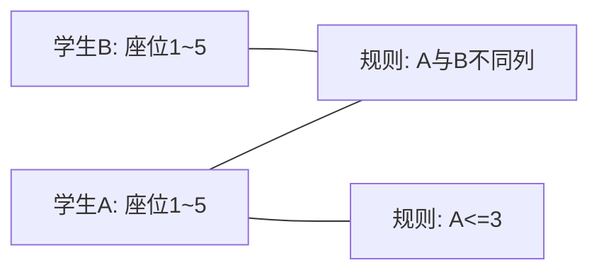
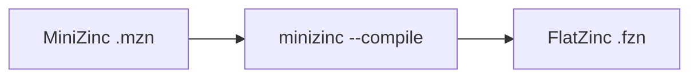
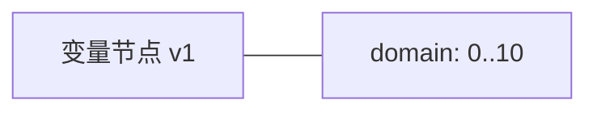
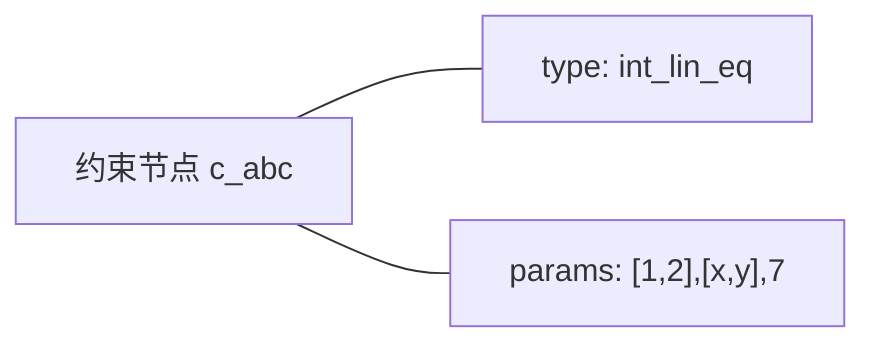
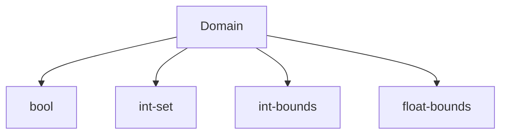
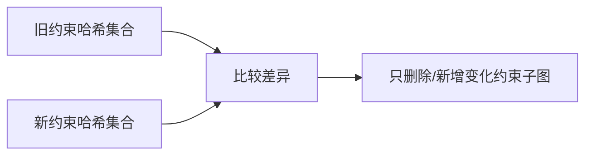
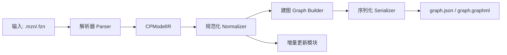

# 从零开始理解 cp2graph：把约束规划模型变成“数学约束网络”图

本文面向零基础读者，目标是让你从“看不懂 CP 模型”到“能独立跑通转换、看懂输出、写出测试”。

---

## 1. 用生活化类比先建立直觉

想象你在组织一场考试：

- 每个学生可选座位范围不同，这就是**变量（Variable）**：一个“可以取值的量”。
- “同班同学不能坐同一列”“监考老师在第 3 排”这类规则，就是**约束（Constraint）**：限制变量如何取值。
- 我们要做的是把“学生+规则”画成一张图，便于程序比较、检索、分析。

### 图示：学生与规则的关系



这张图就是本文的核心产物：**二分图（Bipartite Graph）**。

---

## 2. 核心术语（首次出现就解释 + 图示）

### 2.1 约束规划（CP, Constraint Programming）

通俗解释：不是“直接算答案”，而是先写“允许什么、不允许什么”，再让求解器找满足条件的解。


### 2.2 FlatZinc（FZN）

通俗解释：MiniZinc 的“编译后中间语言”，结构更平、便于程序解析。



### 2.3 变量节点（Variable Node）

通俗解释：图里表示“可变对象”的点，带有取值范围信息（域）。



### 2.4 约束节点（Constraint Node）

通俗解释：图里表示“规则”的点，描述了规则类型和参数。



### 2.5 域（Domain）

通俗解释：变量“允许取哪些值”。

- `bool`: 只能 `true/false`
- `int-set`: 离散集合，如 `{1,3,5}`
- `int-bounds`: 区间，如 `0..10`
- `float-bounds`: 浮点区间，如 `0.0..1.0`



### 2.6 语义哈希（semantic_hash）

通俗解释：给“约束语义内容”算一个稳定指纹。写法不同但语义相同，应尽量得到相同哈希。


### 2.7 增量更新（Incremental Update）

通俗解释：模型改动后，不重建整图，只更新变化的那一部分。



---

## 3. 实现原理（从输入到输出）

系统主流程：

1. 读取 `.fzn`（或把 `.mzn` 先编译成 `.fzn`）。
2. 解析变量、域、约束、目标函数，得到 IR（中间表示）。
3. 归一化（常量折叠、变量重命名、约束去重）。
4. 计算约束语义哈希。
5. 构建变量-约束二分图并序列化为 JSON/GraphML。

### 3.1 系统架构图



---

## 4. 关键算法（可直接对应代码实现）

### 4.1 解析算法（Parser）

输入：FlatZinc 文本  
输出：`CPModelIR(variables, constraints, objective)`

核心动作：

- 去注释、去 BOM。
- 按语法规则识别声明/约束/求解目标。
- 展开数组变量（如 `x[1..3]` 变成 `x[1],x[2],x[3]`）。
- 约束参数转为统一结构（字面量、变量引用、函数调用）。

伪代码：

```text
for each statement in fzn:
  if var_decl: add variable
  if array_var_decl: expand by index and add each variable
  if const_decl/array_const_decl: cache constant
  if constraint: resolve args and append raw constraint
  if solve: parse objective/satisfy
```

### 4.2 规范化算法（Normalizer）

目标：让“语义相同”的模型尽量得到“结构相同”的图。

核心动作：

- 常量折叠：把可替换的常量内联到约束参数。
- 变量标准化重命名：按稳定顺序映射为 `v1,v2,...`。
- 约束去重：按 `(type, normalized_params)` 哈希去重。

伪代码：

```text
mapping = stable_sort(vars) -> v1..vn
for each constraint:
  params1 = fold_constants(params)
  params2 = rename_vars(params1, mapping)
  h = hash(type, params2)
  keep first constraint for each h
```

### 4.3 建图算法（Graph Builder）

核心动作：

- 为每个变量创建变量节点。
- 为每个约束创建约束节点。
- 提取“约束涉及的变量”，连边。
- 对有方向语义的约束（如 `element`）标记 `read/write` 角色。

伪代码：

```text
add all variable nodes
for c in constraints:
  add constraint node
  for var in vars_used_by(c):
    add edge var -> c (role)
    add edge c -> var (role)  # 用双向边表达无向关系
```

### 4.4 增量更新算法（Incremental）

核心动作：

- 比较“旧约束哈希集合”和“新约束哈希集合”。
- 删除消失哈希对应约束节点及其边。
- 新增出现哈希对应约束节点及其边。
- 同步变量节点增删。

---

## 5. 数据流转（一步一步看数据怎么变）

### 5.1 输入示例（FlatZinc）

```fzn
var 0..10: x;
var 0..10: y;
constraint int_lin_eq([1,2],[x,y],7);
solve satisfy;
```

### 5.2 IR 形态（简化）

```json
{
  "variables": {
    "x": {"domain": {"kind": "int-bounds", "lower": 0, "upper": 10}},
    "y": {"domain": {"kind": "int-bounds", "lower": 0, "upper": 10}}
  },
  "constraints": [
    {"type": "int_lin_eq", "params": [[1,2],[{"var":"x"},{"var":"y"}],7]}
  ]
}
```

### 5.3 归一化后（示意）

- `x -> v1`, `y -> v2`
- 约束哈希如 `3f08...`

### 5.4 输出图 JSON（字段固定）

```json
{
  "nodes": [
    {"id":"v1","type":"variable","domain":{"kind":"int-bounds","lower":0,"upper":10},"size":11,"semantic_hash":null},
    {"id":"c_3f08...","type":"constraint","domain":null,"size":null,"semantic_hash":"3f08..."}
  ],
  "edges": [
    {"src":"v1","dst":"c_3f08...","role":"read"},
    {"src":"c_3f08...","dst":"v1","role":"read"}
  ]
}
```

---

## 6. 错误处理设计（你会遇到什么报错）

| 场景 | 触发条件 | 表现 | 建议处理 |
|---|---|---|---|
| 语法错误 | FZN 语句不合法 | 解析异常 | 定位报错行，先用 MiniZinc 官方工具检查 |
| 数组长度不一致 | 声明长度与字面量长度不匹配 | `ValueError` | 修正数组数据长度 |
| 输出格式不支持 | CLI 输出后缀非 json/graphml | `SystemExit` | 使用 `--format json` 或 `--format graphml` |
| MiniZinc 编译失败 | `.mzn` 到 `.fzn` 失败 | `RuntimeError` | 检查 MiniZinc 安装和模型语法 |
| 文件找不到 | 路径错误 | `FileNotFoundError` | 使用绝对路径或基于项目根目录拼接 |

实用建议：  
在 Notebook 中优先使用 `Path(...).resolve()` 生成绝对路径，避免工作目录差异导致找不到文件。

---

## 7. 性能优化策略（为什么能跑得快）

### 7.1 时间优化

- 单次扫描解析语句，减少重复遍历。
- 归一化阶段使用哈希集合去重，近似 O(1) 判断。
- 增量模式只处理差异约束，不全量重建。

### 7.2 内存优化

- 用轻量字典结构表达参数，不复制无关字段。
- 序列化时按需写出固定字段，避免冗余信息。
- 基准脚本设置了“粗略内存上限检查”（文本体积的 5 倍）。

### 7.3 实测基准（当前仓库）

- 10k 行模型：约 `1.76s`
- 覆盖率：`92%`
- 10,000 随机模型哈希抽样冲突：`0`

---

## 8. 可运行最小示例（一步复制即运行）

文件：`examples/minimal_demo.py`

```python
from pathlib import Path

from cp2graph import graph_fingerprint, parse_model_text_to_graph
from cp2graph.serialize import write_graph_json


def main() -> None:
    fzn_text = """
var 0..10: x;
var 0..10: y;
constraint int_lin_eq([1,2],[x,y],7);
solve satisfy;
""".strip()

    graph = parse_model_text_to_graph(fzn_text, normalize=True)
    out = Path("examples") / "minimal_graph.json"
    write_graph_json(graph, out)

    print("nodes =", graph.number_of_nodes())
    print("edges =", graph.number_of_edges())
    print("hash  =", graph_fingerprint(graph))
    print("json  =", out.resolve())


if __name__ == "__main__":
    main()
```

运行命令：

```bash
python examples/minimal_demo.py
```

---

## 9. 最小测试用例（验证示例真的能跑）

文件：`tests/test_minimal_demo.py`

```python
from cp2graph import parse_model_text_to_graph


def test_minimal_demo_graph_build() -> None:
    text = """
var 0..10: x;
var 0..10: y;
constraint int_lin_eq([1,2],[x,y],7);
solve satisfy;
""".strip()
    g = parse_model_text_to_graph(text, normalize=True)
    assert g.number_of_nodes() >= 3
    assert g.number_of_edges() >= 4
```

运行：

```bash
pytest -q
```

---

## 10. 常见疑问（FAQ）

### Q1：为什么要先转 FlatZinc，不直接解析 MiniZinc？

因为 MiniZinc 语法更丰富（循环、推导式、语法糖多），FlatZinc 更“扁平”，解析更稳定、可控。

### Q2：两个模型语义等价但写法不同，一定同哈希吗？

“目标是尽量同哈希”，当前依赖规范化规则。越完善的规范化，越容易做到一致。

### Q3：`semantic_hash` 冲突怎么办？

工程上采用 `blake2b-128`，冲突概率很低；并提供了随机抽样脚本做经验验证。

### Q4：为什么边是双向的？

因为需求里“无向关系 + 有向角色”并存。实现上用双向边表达无向连通，同时在边属性中保留 `read/write`。

### Q5：Notebook 里相对路径常报错怎么办？

用 `Path.cwd()` 检查当前目录，再用绝对路径或 `repo_root / "tests/models/..."` 方式拼接。

---

## 11. 进一步学习路径（按阶段）

1. 入门（1-2 天）  
读本文 + 跑 `examples/minimal_demo.py` + 看 `graph.json`。

2. 进阶（3-7 天）  
阅读 `parser.py`、`normalize.py`、`graph_builder.py`，尝试新增 2 种约束类型。

3. 实战（1-2 周）  
接入外部 benchmark，统计图规模、哈希稳定性、增量更新收益。

4. 深化（持续）  
研究 CP 全局约束语义标准化、图同构、图检索与模型相似度计算。

---

## 12. 你现在可以做什么

- 跑 CLI：`cp2graph tests/models/m01_arith.fzn -o graph.json --hash`
- 改 1 行约束，再次生成图，比对哈希变化。
- 使用增量 API，观察只更新变化约束的效果。

如果你希望，我还可以基于这份文档再补一版“配套图解 PDF（教学版）”和“术语速查表（1 页）”。
